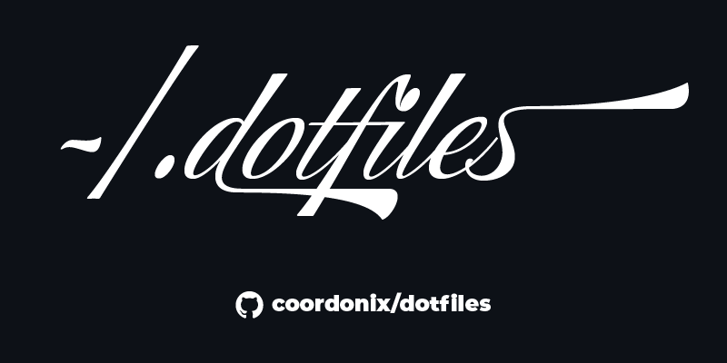

<a id="readme-top"></a>

<!-- PROJECT SHIELDS -->
<!--
*** I'm using markdown "reference style" links for readability.
*** Reference links are enclosed in brackets [ ] instead of parentheses ( ).
*** See the bottom of this document for the declaration of the reference variables
*** for contributors-url, forks-url, etc. This is an optional, concise syntax you may use.
*** https://www.markdownguide.org/basic-syntax/#reference-style-links
-->
[![Contributors][contributors-shield]][contributors-url]
[![Forks][forks-shield]][forks-url]
[![Stargazers][stars-shield]][stars-url]
[![Issues][issues-shield]][issues-url]
[![project_license][license-shield]][license-url]


<!-- PROJECT LOGO -->
<br />
<div align="center">
  <a href="https://github.com/coordonix/dotfiles">
    
  </a>

<h3 align="center">Configuration Files</h3>

  <p align="center">
    This is a collection of bash, vim, and supporting configuration files, designed to streamline and enhance the development environment.
    <br />
    <a href="https://github.com/coordonix/dotfiles"><strong>Explore the docs »</strong></a>
    <br />
    <br />
    <a href="https://github.com/coordonix/dotfiles">View Demo</a>
    &middot;
    <a href="https://github.com/coordonix/dotfiles/issues/new?labels=bug&template=bug-report---.md">Report Bug</a>
    &middot;
    <a href="https://github.com/coordonix/dotfiles/issues/new?labels=enhancement&template=feature-request---.md">Request Feature</a>
  </p>
</div>


<!-- TABLE OF CONTENTS -->
<details>
  <summary>Table of Contents</summary>
  <ol>
    <li>
      <a href="#about-the-project">About The Project</a>
      <ul>
        <li><a href="#built-with">Built With</a></li>
      </ul>
    </li>
    <li>
      <a href="#getting-started">Getting Started</a>
      <ul>
        <li><a href="#prerequisites">Prerequisites</a></li>
        <li><a href="#installation">Installation</a></li>
      </ul>
    </li>
    <li><a href="#usage">Usage</a></li>
    <li><a href="#roadmap">Roadmap</a></li>
    <li><a href="#contributing">Contributing</a></li>
    <li><a href="#license">License</a></li>
    <li><a href="#contact">Contact</a></li>
    <li><a href="#acknowledgments">Acknowledgments</a></li>
  </ol>
</details>


<!-- ABOUT THE PROJECT -->
## About The Project

**dotfiles** is a collection of configuration files. This repository houses settings for bash, vim, and other supporting configuration files that I utilize to enhance my workflow. Feel free to explore and adapt these configuration files to enhance your own workflow.

This repository is organized into directories for each set of configuration, such as `bash` and `vim`, along with supporting files located in the `resources` directory. This collection offers a well documented and accessible way to setup your development environment.

<p align="right">(<a href="#readme-top">back to top</a>)</p>


### Built With

* [![Python][Python]][Python-url]
* [![Bash][Bash]][Bash-url]
* [![Vim][Vim]][Vim-url]

<p align="right">(<a href="#readme-top">back to top</a>)</p>


<!-- GETTING STARTED -->
## Getting Started

This repository contains configuration files for setting up your Bash and Vim environments. The provided installation script allows you to easily create symbolic links for the configuration files, enabling you to apply them to your home directory.

### Prerequisites

  * **WSL or a Linux Environment**
  * **Bash** _Check if installed with `bash --version`_
  * **Vim** _Check if installed with `vim --version`_
  * **Git** _(Optional, if you're cloning the repository)_

### Installation

1. **Clone the Repository _(Optional)_:** If you haven't already cloned this repository to your system, you can do so by running the following command:
```bash
git clone https://github.com/coordonix/dotfiles.git
cd dotfiles
```

<p align="right">(<a href="#readme-top">back to top</a>)</p>


<!-- USAGE EXAMPLES -->
## Usage

**Run the Installation Script:** The script provided `install.sh` will backup existing configuration files and create symbolic links for your new Bash and Vim configuration files.

You can run the script with one of the following options:
  * **For Bash Configurations:** `./install.sh bash`
  * **For Vim Configurations:** `./install.sh vim`
  * **For Resources Configurations:** `./install.sh resources`
  * **For All Configurations:** `./install.sh all`

<p align="right">(<a href="#readme-top">back to top</a>)</p>


<!-- ROADMAP -->
## Roadmap

- [X] Installation script to backup existing configuration files, and create symbolic links for the new configurations.

See the [open issues](https://github.com/coordonix/dotfiles/issues) for a full list of proposed features (and known issues).

<p align="right">(<a href="#readme-top">back to top</a>)</p>


<!-- CONTRIBUTING -->
## Contributing

Contributions are what make the open source community such an amazing place to learn, inspire, and create. Any contributions you make are **greatly appreciated**.

If you have a suggestion that would make this better, please fork the repo and create a pull request. You can also simply open an issue with the tag "enhancement".
Don't forget to give the project a star! Thanks again!

1. Fork the Project
2. Create your Feature Branch (`git checkout -b feature/AmazingFeature`)
3. Commit your Changes (`git commit -m 'Add some AmazingFeature'`)
4. Push to the Branch (`git push origin feature/AmazingFeature`)
5. Open a Pull Request

<p align="right">(<a href="#readme-top">back to top</a>)</p>

### Top contributors:

<a href="https://github.com/coordonix/dotfiles/graphs/contributors">
  
</a>


<!-- LICENSE -->
## License

Distributed under the MIT License. See `LICENSE.md` for more information.

<p align="right">(<a href="#readme-top">back to top</a>)</p>


<!-- CONTACT -->
## Contact

Support - support@coordonix.com

Project Link: [https://github.com/coordonix/dotfiles](https://github.com/coordonix/dotfiles)

<p align="right">(<a href="#readme-top">back to top</a>)</p>


<!-- ACKNOWLEDGMENTS -->
## Acknowledgments

* [Brent Hurst](https://github.com/brenthurst) - For mentoring my journey in bash, vim, and linux in general.
* [Chris Dean](https://github.com/chrisdean258) - For creating the foundational .vimrc file.
* [Othneil Drew](https://github.com/othneildrew) - For creating a fantastic README template.

<p align="right">(<a href="#readme-top">back to top</a>)</p>


<!-- MARKDOWN LINKS & IMAGES -->
<!-- https://www.markdownguide.org/basic-syntax/#reference-style-links -->
[contributors-shield]: https://img.shields.io/github/contributors/coordonix/dotfiles.svg?style=for-the-badge
[contributors-url]: https://github.com/coordonix/dotfiles/graphs/contributors
[forks-shield]: https://img.shields.io/github/forks/coordonix/dotfiles.svg?style=for-the-badge
[forks-url]: https://github.com/coordonix/dotfiles/network/members
[stars-shield]: https://img.shields.io/github/stars/coordonix/dotfiles.svg?style=for-the-badge
[stars-url]: https://github.com/coordonix/dotfiles/stargazers
[issues-shield]: https://img.shields.io/github/issues/coordonix/dotfiles.svg?style=for-the-badge
[issues-url]: https://github.com/coordonix/dotfiles/issues
[license-shield]: https://img.shields.io/github/license/coordonix/dotfiles.svg?style=for-the-badge
[license-url]: https://github.com/coordonix/dotfiles/blob/master/LICENSE.md
[product-screenshot]: images/screenshot.png
[Python]: https://img.shields.io/badge/python-3776AB?style=for-the-badge&logo=python&logoColor=white
[Python-url]: https://python.org/
[Bash]: https://img.shields.io/badge/gnubash-4EAA25?style=for-the-badge&logo=gnubash&logoColor=white
[Bash-url]: https://gnu.org/
[Vim]: https://img.shields.io/badge/vim-019733?style=for-the-badge&logo=vim&logoColor=white
[Vim-url]: https://vim.org/
